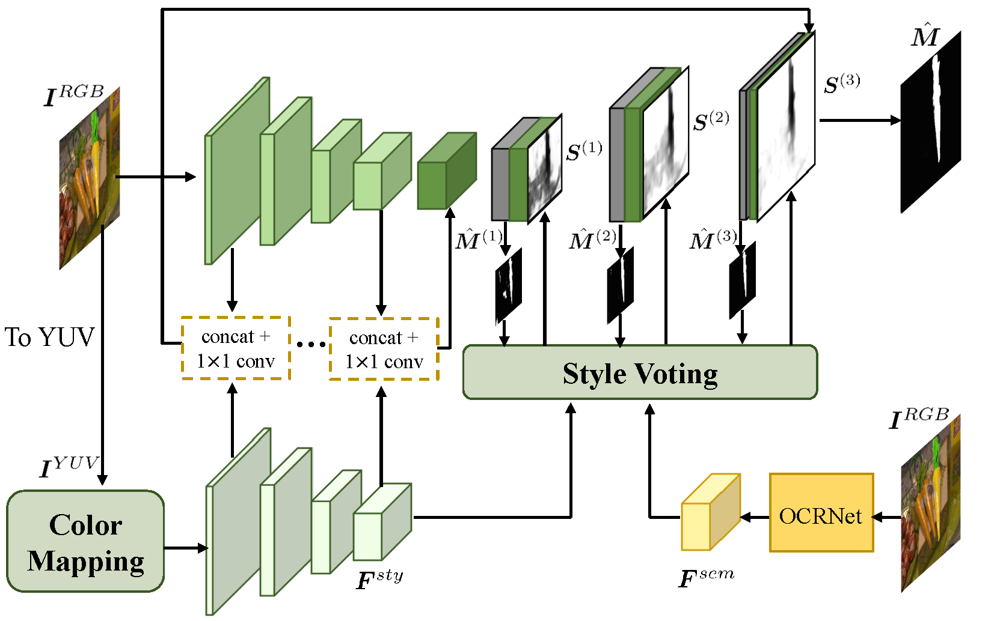

# AustNet-Inharmonious-Region-Localization



This is the official code of the paper:
> Inharmonious Region Localization with Auxiliary Style Feature           
Penghao Wu, Li Niu, Liqing Zhang                                                             
[arXiv Paper](https://arxiv.org/abs/2210.02029), BMVC 2022

## Online Demo

Try this [online demo](http://libcom.ustcnewly.com/) for image composition (object insertion) built upon [libcom](https://github.com/bcmi/libcom) toolbox and have fun!

[![]](https://github.com/user-attachments/assets/87416ec5-2461-42cb-9f2d-5030b1e1b5ec)

## Install
Clone this repo and build the environment

```
git clone https://github.com/bcmi/AustNet-Inharmonious-Region-Localization.git
cd AustNet-Inharmonious-Region-Localization
conda env create -f environment.yml --name Austnet
conda activate Austnet
```

Download the semantic segmentation network model weight through link [Dropbox](https://www.dropbox.com/scl/fi/lby093g1d12aqbuhblztr/hrnet_ocr_cocostuff_3965_torch04.pth?rlkey=5bemk4eo9vla59b9rbaikba6j&st=q6otmhew&dl=0) or [Baidu Yun](https://pan.baidu.com/s/1SSRMI8QYCtRsG9E2zmOiOg) with code pfpy. Put the model weight in the HRNet-Semantic-Segmentation-HRNet-OCR folder.

## Datset
Please refer to [DIRL](https://github.com/bcmi/DIRL-Inharmonious-Region-Localization) to download the iHarmoney4 dataset.

## Training

To train AustNet, run

```
python train_austnet.py --dataset_root PATH_OF_THE_DATASET --logdir austnet_training_log --gpus NUMBER_OF_GPUS
```
To train AustNet_S, run
```
python train_austnet_s.py --dataset_root PATH_OF_THE_DATASET --logdir austnet_s_training_log --gpus NUMBER_OF_GPUS
```


## Pretrained Model

|Model| Google Drive Link| Baidu Yun Link|
|-----------|--------------|--------------|
| Austnet   | [Dropbox](https://www.dropbox.com/scl/fi/p4m7mwq3o4on0jmrbklrz/austnet.ckpt?rlkey=c7pp2qzwaxhy5h1n0i4bz3mnw&st=2i4ymgju&dl=0) | [Baidu Yun](https://pan.baidu.com/s/1Z7r6p4LgJKqekZaJ3ctPpQ) code: m8ku   |
| Austnet_s | [Dropbox](https://www.dropbox.com/scl/fi/bxd1y6ap35zu6vj8hledt/austnet_s.ckpt?rlkey=7f9hezvfdohldutdbmny1az9z&st=7axw25zx&dl=0) | [Baidu Yun](https://pan.baidu.com/s/1LwAWRiFCceoX_wcLOtS5vQ) code: jrdi|


## Evaluation

To evaluate AustNet, run

```
python test_austnet.py --dataset_root PATH_OF_THE_DATASET --ckpt MODEL_WEIGHT_PATH
```
To evaluate AustNet_S, run
```
python test_austnet_s.py --dataset_root PATH_OF_THE_DATASET --ckpt MODEL_WEIGHT_PATH
```

## Citation

If you find our work or code helpful, please cite:
````
@inproceedings{Wu2022Inharmonious,
  title={Inharmonious Region Localization with Auxiliary Style Feature},
  author={Penghao Wu and Li Niu and Liqing Zhang},
  booktitle={BMVC},
  year={2022}
}
````

## Acknowledgement
Our code is based on repositories:
- [DIRL](https://github.com/bcmi/DIRL-Inharmonious-Region-Localization)
- [HRNet-OCR](https://github.com/HRNet/HRNet-Semantic-Segmentation)
